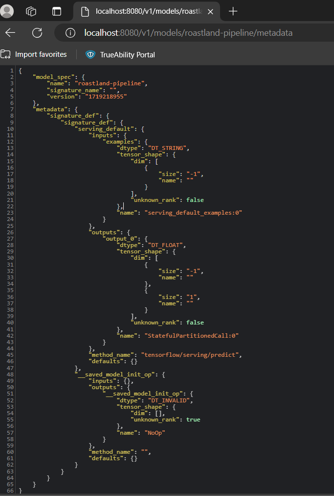
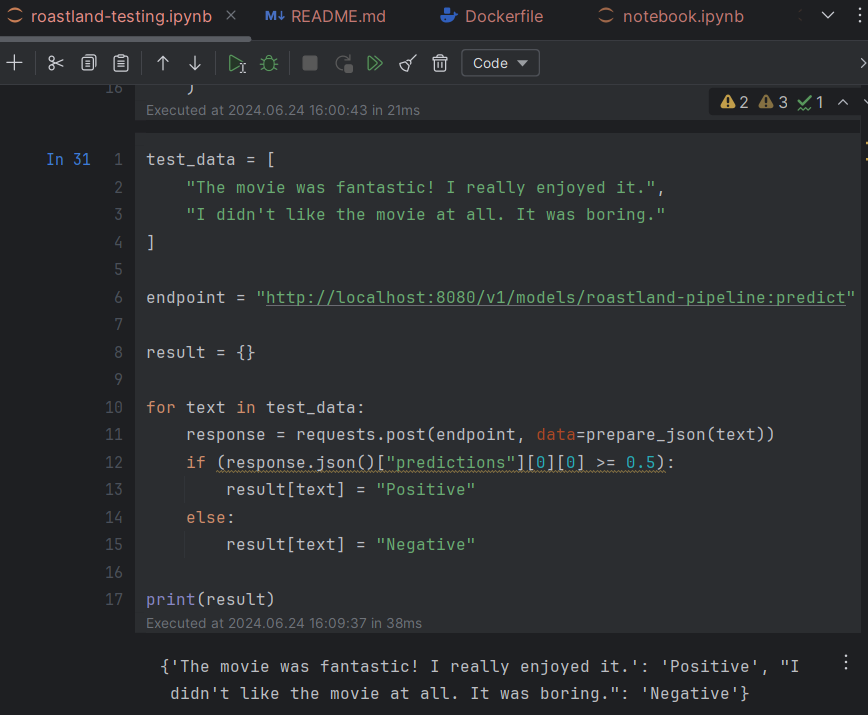

# Submission 1: IMDB Review Sentiment
Nama: Taufan Fajarama PR

Username dicoding: roastland

| | Deskripsi                                                                                                                                                                                                                                                                                                                                                                                                                                                                                                                                                                                                                                                                                                                                                                                                                                                                                                                                                                                                                                                                                                                                                                                                                                                                               |
| ----------- |-----------------------------------------------------------------------------------------------------------------------------------------------------------------------------------------------------------------------------------------------------------------------------------------------------------------------------------------------------------------------------------------------------------------------------------------------------------------------------------------------------------------------------------------------------------------------------------------------------------------------------------------------------------------------------------------------------------------------------------------------------------------------------------------------------------------------------------------------------------------------------------------------------------------------------------------------------------------------------------------------------------------------------------------------------------------------------------------------------------------------------------------------------------------------------------------------------------------------------------------------------------------------------------------|
| Dataset | [IMDB Reviews Dataset](http://ai.stanford.edu/~amaas/data/sentiment/)                                                                                                                                                                                                                                                                                                                                                                                                                                                                                                                                                                                                                                                                                                                                                                                                                                                                                                                                                                                                                                                                                                                                                                                                                   |
| Masalah | IMBD adalah kanal paling terkenal untuk mengetahui *rating* dan ulasan dari film/TV *shows*. Ulasan yang diberikan penonton pada suatu film bisa saja kurang sesuai dengan *rating* yang diberikannya, seperti misalnya sebuah film diberi rating 4/10, tetapi penonton tersebut menuliskan ulasan yang memuji, menjadi tidak konsisten.   Maka dari itu proyek ini mengambil dataset IMDB Reviews yang hanya berisi teks ulasan dan klasifikasi yang seharusnya. Tujuan dari proyek ini adalah untuk menentukan sentimen apakah sebuah ulasan film bersifat positif atau negatif. *Dataset* IMDB Review berisi 25.000 data latih dan 25.000 data uji yang masing-masing memiliki struktur 1 fitur dan 1 label, yaitu fitur teks `review` dan label `isPositive` (0 jika negatif, 1 jika positif).                                                                                                                                                                                                                                                                                                                                                                                                                                                                                  |
| Solusi machine learning | Solusi *machine learning* yang akan dibangun adalah model *binary classification* menggunakan *neural network* untuk memprediksi sentimen ulasan film sebagai positif atau negatif. Solusi ini dapat dimanfaatkan baik oleh penonton awam untuk mengetahui seberapa positif atau negatif suatu film berdasarkan ulasannya dan dapat dimanfaatkan pula oleh stakeholder industri perfilman untuk mempelajari saran dan pola ulasan positif/negatif untuk pengembangan film selanjutnya.                                                                                                                                                                                                                                                                                                                                                                                                                                                                                                                                                                                                                                                                                                                                                                                                  |
| Metode pengolahan | *Dataset* awal diperolah melalui `Tensorflow Datasets` yang kemudian ditransformasi menjadi `numpy array` dan `pandas dataframe` yang kemudian di-*export* dalam bentuk `csv` sehingga lebih mudah diolah. Solusi *machine learning* dibuat dalam sebuah *machine learning pipeline* menggunakan TFX dan komponen-komponennya yang diajarkan di kelas.                                                                                                                                                                                                                                                                                                                                                                                                                                                                                                                                                                                                                                                                                                                                                                                                                                                                                                                                  |
| Arsitektur model | Model *machine learning* yang dibuat terdiri dari *layer* `review_xf (InputLayer)` sebagai *layer input*, diikuti *layer* `tf.reshape (TFOpLambda)`, `text_vectorization (TextVectorization)`, `embedding (Embedding)`, `global_average_pooling1d (GlobalAveragePooling1D)`, dan 3 *layer* `Dense` sebagai output.                                                                                                                                                                                                                                                                                                                                                                                                                                                                                                                                                                                                                                                                                                                                                                                                                                                                                                                                                                      |
| Metrik evaluasi | Model dievaluasi menggunakan akurasi biner (`binary_accuracy`) untuk mengukur kinerjanya pada dataset uji karena tugas dari *machine learning model* yang dibuat adalah *binary classification* untuk analisis sentimen ulasan film.   Model juga dievaluasi dengan metrik `AUC` (*Area Under Curve*) yang mewakili derajat atau ukuran keterpisahan. Metrik ini menunjukkan seberapa mampu model dalam membedakan antar kelas. Semakin tinggi AUC, semakin baik model dalam memprediksi kelas 0 sebagai 0 dan kelas 1 sebagai 1.   Beberapa metrik evaluasi lainnya untuk menunjukkan akurasi model adalah `FalsePositives` yang menandakan jumlah data yang salah diklasifikasi sebagai kelas positif (seharusnya 0 di kolom `isPositive` tapi diklasifikasi menjadi 1), `TruePositives` yang menandakan jumlah data yang benar diklasifikasi sebagai kelas positif (seharusnya 0 di kolom `isPositive` dan benar diklasifikasi menjadi 0), `FalseNegatives` yang menandakan jumlah data yang salah diklasifikasi sebagai kelas negatif (seharusnya 1 di kolom `isPositive` tapi diklasifikasi menjadi 0), `TrueNegatives` yang menandakan jumlah data yang benar diklasifikasi sebagai kelas negatif (seharusnya 0 di kolom `isPositive` dan benar diklasifikasi menjadi 0). |
| Performa model | Model ini mencapai akurasi biner (`binary_accuracy`) sebesar 0.80044 (80.04%), `AUC` sebesar 0.8687056735999998 (86.87%), `FalsePositives` sebanyak 2333 data, `TruePositives` sebanyak 9844 data, `FalseNegatives` sebanyak 2656 data, dan `TrueNegatives` sebanyak 10167 data. Hasil metrik tersebut menunjukkan model memiliki akurasi cukup tinggi dan bisa dipercaya untuk menentukan sentimen ulasan film.                                                                                                                                                                                                                                                                                                                                                                                                                                                                                                                                                                                                                                                                                                                                                                                                                                                                        |

## Saran/Bonus yang Dikerjakan
- Menambahkan tahapan model deployment dengan TensorFlow Serving. Dapat dilihat pada [Dockerfile](Dockerfile).

- Menambahkan sebuah berkas notebook untuk menguji dan melakukan prediction request ke model serving yang telah dibuat. Dapat dilihat pada [roastland-testing.ipynb](roastland-testing.ipynb).

