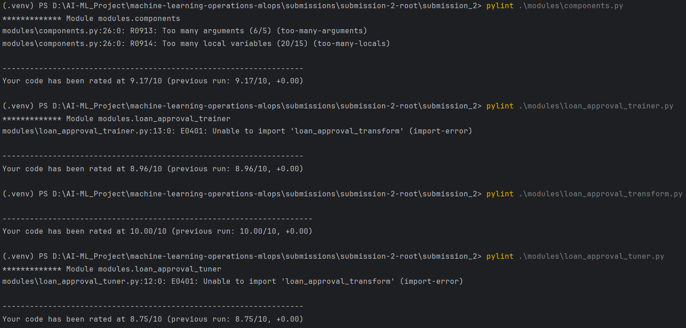
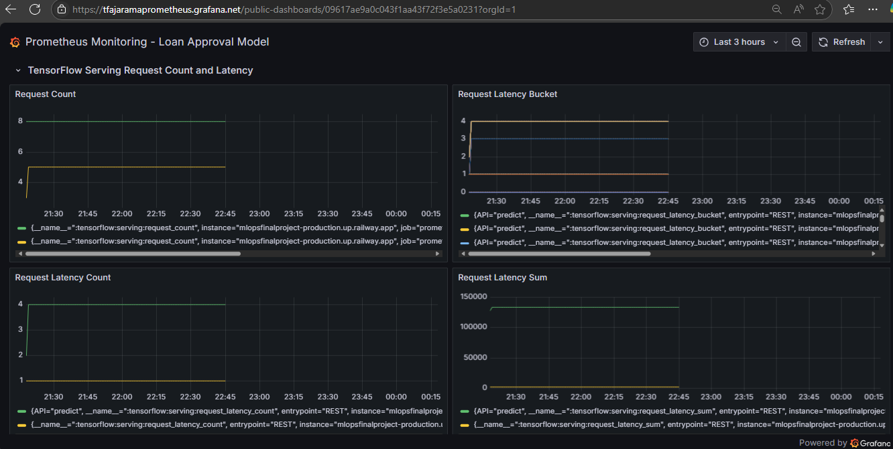

# Submission 2: Loan Approval Classification
Nama: Taufan Fajarama P. Ruslanali

Username dicoding: tfajarama

|                         | Deskripsi                                                                                                                                                                                                                                                                                                                                                                                                                                                                                                                                                                                                                                                                                                                                                                                                                                                                                                                                                                                                                                                                                                                                                                                                                                                                                                                                                                                                                                                                                                                                                                                                                                                                                                           |
|-------------------------|---------------------------------------------------------------------------------------------------------------------------------------------------------------------------------------------------------------------------------------------------------------------------------------------------------------------------------------------------------------------------------------------------------------------------------------------------------------------------------------------------------------------------------------------------------------------------------------------------------------------------------------------------------------------------------------------------------------------------------------------------------------------------------------------------------------------------------------------------------------------------------------------------------------------------------------------------------------------------------------------------------------------------------------------------------------------------------------------------------------------------------------------------------------------------------------------------------------------------------------------------------------------------------------------------------------------------------------------------------------------------------------------------------------------------------------------------------------------------------------------------------------------------------------------------------------------------------------------------------------------------------------------------------------------------------------------------------------------|
| Dataset                 | [Loan Approval Classification Dataset](https://www.kaggle.com/datasets/taweilo/loan-approval-classification-data/data)                                                                                                                                                                                                                                                                                                                                                                                                                                                                                                                                                                                                                                                                                                                                                                                                                                                                                                                                                                                                                                                                                                                                                                                                                                                                                                                                                                                                                                                                                                                                                                                              |
| Masalah                 | Pinjaman dana atau kredit sangat membantu bagi setiap orang untuk memenuhi berbagai tujuan finansial, seperti kredit rumah, pinjaman wirausaha, dan lain sebagainya. Akan tetapi, tidak semua orang yang mengajukan pinjaman dapat disetujui, persetujuan pinjaman sering kali bergantung pada berbagai faktor risiko keuangan, seperti skor kredit, penghasilan, dan riwayat pinjaman sebelumnya.    Maka dari itu, proyek ini mengambil dataset *Loan Approval Classification* yang berisi data sintetik dari data pribadi yang berhubungan dengan pengajuan pinjaman. Tujuan dari proyek ini adalah untuk menentukan klasifikasi persetujuan pinjaman (approved/rejected) berdasarkan data-data pribadi tersebut.    *Loan Approval Classification Dataset* berisi 45.000 data yang masing-masing memiliki struktur 13 variabel fitur dan 1 variabel target, yaitu fitur `person_age` (usia orang tersebut), `person_gender` (jenis kelamin orang tersebut), `person_education` (tingkat pendidikan tertinggi), `person_income` (pendapatan tahunan), `person_emp_exp` (pengalaman kerja dalam tahun), `person_home_ownership` (status kepemilikan rumah (misalnya, sewa, milik sendiri, dll)), `loan_amnt` (jumlah pinjaman yang diminta), `loan_intent` (tujuan pinjaman), `loan_int_rate` (tingkat bunga pinjaman), `loan_percent_income` (jumlah pinjaman sebagai persentase dari pendapatan tahunan), `cb_person_cred_hist_length` (lamanya riwayat kredit dalam tahun), `credit_score` (skor kredit orang tersebut), `previous_loan_defaults_on_file` (indikator kegagalan pembayaran pinjaman sebelumnya), dan target `loan_status` (0 jika rejected/ditolak, 1 jika approved/disetujui). |
| Solusi machine learning | Solusi *machine learning* yang dibangun adalah model *binary classification* menggunakan *neural network* untuk memprediksi persetujuan pinjaman finansial sebagai disetujui (*approved*) atau ditolak (*rejected*). Solusi ini dapat dimanfaatkan baik oleh calon peminjam dana untuk mengetahui prediksi persetujuan pinjaman berdasarkan beberapa data pribadinya maupun oleh stakeholder bank/pemberi pinjaman dana untuk mempelajari pola data pribadi peminjam dalam persetujuan pinjaman dana selanjutnya.                                                                                                                                                                                                                                                                                                                                                                                                                                                                                                                                                                                                                                                                                                                                                                                                                                                                                                                                                                                                                                                                                                                                                                                                   |
| Metode pengolahan       | Solusi *machine learning* dibuat dalam sebuah *machine learning pipeline* menggunakan TFX (TensorFlow Extended) dan komponen-komponennya. *Dataset* awal diperolah melalui `Kaggle` dalam format `csv` yang kemudian ditempatkan pada *directory* `data` dan selanjutnya diolah melalui TFX component `CSVExampleGen`. Selanjutnya. dataset diolah pada TFX component `Transform` menggunakan sebuah [modul transform](./modules/loan_approval_transform.py). Modul tersebut merubah kolom kategorikal pada dataset menjadi numerik menggunakan *one-hot encoding* sehingga selanjutnya dataset siap digunakan untuk melatih model.                                                                                                                                                                                                                                                                                                                                                                                                                                                                                                                                                                                                                                                                                                                                                                                                                                                                                                                                                                                                                                                                                 |
| Arsitektur model        | Model *machine learning* yang dibuat terdiri dari *input layer* `concatenate` berisi fitur-fitur dalam format `InputLayer`, diikuti 3 *hidden layer* `Dense`, dan 1 *output layer* `Dense`.                                                                                                                                                                                                                                                                                                                                                                                                                                                                                                                                                                                                                                                                                                                                                                                                                                                                                                                                                                                                                                                                                                                                                                                                                                                                                                                                                                                                                                                                                                                         |
| Metrik evaluasi         | Model dievaluasi menggunakan akurasi biner (`binary_accuracy`) untuk mengukur kinerjanya pada dataset karena tugas dari *machine learning model* yang dibuat adalah *binary classification* untuk prediksi persetujuan pinjaman finansial.    Model juga dievaluasi dengan metrik `AUC` (*Area Under Curve*) yang mewakili derajat atau ukuran keterpisahan. Metrik ini menunjukkan seberapa mampu model dalam membedakan antar kelas. Semakin tinggi AUC, semakin baik model dalam memprediksi kelas 0 sebagai 0 dan kelas 1 sebagai 1.    Beberapa metrik evaluasi lainnya untuk menunjukkan akurasi model adalah `Precision` yang menandakan proporsi jumlah data yang diklasifikasi secara tepat sebagai kelas positif sebenarnya (True Positive) berbanding dengan seluruh jumlah data yang diklasifikasi sebagai kelas positif (True Positive + False Positive), dan `Recall` yang menandakan proporsi jumlah data yang diklasifikasi secara tepat sebagai kelas positif sebenarnya (True Positive) berbanding dengan seluruh jumlah data yang sebenarnya kelas positif (True Positive + False Negative).                                                                                                                                                                                                                                                                                                                                                                                                                                                                                                                                                                                     |
| Performa model          | Model ini mencapai metrik evaluasi:   - Akurasi biner (`binary_accuracy`) sebesar 0.9120140953639467 (91.20%),   - *Area Under Curve* (`AUC`) sebesar 0.9646401905449972 (96.46%),   - `Precision` sebesar 0.8493771234428086 (84.94%), dan   - `Recall` sebesar 0.7378258730939499 (73.78%).   Hasil metrik-metrik tersebut menunjukkan model memiliki akurasi cukup tinggi dan bisa dipercaya untuk menentukan persetujuan pinjaman dari calon peminjam dana.                                                                                                                                                                                                                                                                                                                                                                                                                                                                                                                                                                                                                                                                                                                                                                                                                                                                                                                                                                                                                                                                                                                                                                                                                                 |
| Opsi deployment         | Deployment model dilakukan dengan memanfaatkan TFServing, Docker, dan Railway, Prometheus, dan Grafana. TFServing digunakan untuk menyiapkan format model yang akan digunakan. Docker digunakan untuk menyiapkan docker image berisi model TFServing yang akan di-deploy ke cloud service. Railway digunakan sebagai cloud service yang menjalankan model secara real-time di cloud. Prothemeus digunakan untuk memantau metrik dari model TFServing yang sudah di-deploy menggunakan Docker ke Railway. Grafana digunakan untuk membuat dashboard yang menampilkan beberapa metrik utama dari metrik monitoring Prometheus.                                                                                                                                                                                                                                                                                                                                                                                                                                                                                                                                                                                                                                                                                                                                                                                                                                                                                                                                                                                                                                                                                        |
| Web app                 | Berikut tautan web app menggunakan Railway yang digunakan untuk mengakses model serving: [mlopsfinalproject-production.up.railway.app](https://mlopsfinalproject-production.up.railway.app).   Berikut *path* untuk mengakses metadata model: [/v1/models/loan_approval_model/metadata](https://mlopsfinalproject-production.up.railway.app/v1/models/loan_approval_model/metadata).   Berikut *path* untuk mengakses hasil monitoring Prometheus: [/monitoring/prometheus/metrics](https://mlopsfinalproject-production.up.railway.app/monitoring/prometheus/metrics).                                                                                                                                                                                                                                                                                                                                                                                                                                                                                                                                                                                                                                                                                                                                                                                                                                                                                                                                                                                                                                                                                                                                     |
| Monitoring | 	Berikut adalah hasil monitoring dari beberapa metrik Prometheus:   - `tensorflow:serving:request_count` menunjukkan jumlah permintaan inferensi yang stabil dengan nilai rata-rata 2 permintaan per menit, tanpa lonjakan signifikan.   - `tensorflow:serving:request_latency_sum` menunjukkan total latensi kumulatif sekitar 130 ms per menit, dengan fluktuasi kecil, menandakan latensi stabil.   - `tensorflow:serving:runtime_latency_sum` memiliki rata-rata 130 ms per menit, dengan sedikit fluktuasi.   - `tensorflow:cc:saved_model:load_latency_by_stage_sum` menunjukkan waktu muat rata-rata 150 ms, menandakan latensi stabil.   - `tensorflow:core:graph_run_time_usecs` memiliki nilai stabil di 140 ms per grafik, menandakan efisiensi eksekusi grafik model.   Hasil ini memang belum menggambarkan performa pipeline secara keseluruhan karena penggunaan model hanya sedikit (untuk testing), tetapi tetap menunjukkan performa pipeline yang cukup stabil.                                                                                                                                                                                                                                                                                                                                                                                                                                                                                                                                                                                                                                                                                                          |

## Saran/Bonus yang Dikerjakan
- [Bonus 1] Memanfaatkan komponen Tuner untuk menjalankan proses hyperparameter tuning secara otomatis. Dapat dilihat pada [loan_approval_tuner](./modules/loan_approval_tuner.py).
- [Bonus 2] Menerapkan prinsip clean code dalam membuat machine learning pipeline. Dapat dilihat pada [tfajarama-pylint.png](tfajarama-pylint.png).

- [Bonus 3] Menambahkan sebuah berkas notebook untuk menguji dan melakukan prediction request ke sistem machine learning yang telah dijalankan di cloud. Dapat dilihat pada [tfajarama-testing.ipynb](tfajarama-testing.ipynb).
- [Bonus 4] Menyinkronkan Prometheus dengan Grafana untuk membuat dashboard monitoring yang lebih menarik. Dapat dilihat pada [tfajarama-grafana-dashboard](https://tfajaramaprometheus.grafana.net/public-dashboards/09617ae9a0c043f1aa43f72f3e5a0231).
